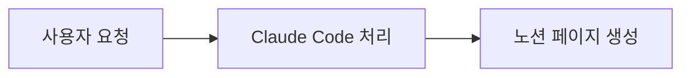

# Notion Session Log

현재 Claude Code 대화 세션의 내용을 분석하여, 노션 데이터베이스에 한국어로 구조적으로 정리된 페이지를 생성한다.

## 대상 데이터베이스

- **데이터베이스**: AI Practices
- **Data Source ID**: `326ffa74-a2ce-802d-8a10-000ba61cbcdc`
- **속성**:
  - `Name` (title): 페이지 제목
  - `카테고리` (select): 스킬 | 설정 | 워크플로우 | 코딩 | 학습 | 기타
  - `생성일자` (created_time): 자동 설정

## 실행 절차

### 1단계: 대화 분석

현재 대화 컨텍스트를 처음부터 끝까지 읽고 다음을 파악한다:

- 이 대화의 핵심 주제와 성격은 무엇인가?
- 어떤 지식, 작업, 결정이 이 대화에서 만들어졌는가?
- 이 대화의 결과물을 나중에 다시 볼 때 어떤 형태가 가장 유용할 것인가?

### 2단계: 카테고리 결정

대화 내용의 성격에 맞는 카테고리를 하나 선택한다. 사용자가 인자로 카테고리를 지정했다면 그것을 우선한다.

- **스킬**: 스킬 생성, 수정, 설정, 가이드 등 스킬 관련
- **설정**: 권한, 환경설정, hooks, MCP 등 도구 설정 관련
- **워크플로우**: 개발 프로세스, 자동화, CI/CD 등 흐름 관련
- **코딩**: 코드 구현, 버그 수정, 리팩토링 등 코드 작업 관련
- **학습**: 개념 정리, Q&A, 기술 이해 등 지식 습득 관련
- **기타**: 위 어디에도 명확히 해당하지 않는 경우

### 3단계: 제목 작성

제목은 대화의 핵심을 한눈에 파악할 수 있도록 한국어로 간결하게 작성한다.

좋은 예: "Next.js 프로젝트에 다크모드 토글 구현", "ESLint + Prettier 설정 통합"
나쁜 예: "2024-03-17 대화", "코드 작업"

### 4단계: 내용에 맞는 구조 결정

이것이 이 커맨드의 핵심이다. 고정된 템플릿을 쓰지 않는다. 대화 내용의 성격에 따라 가장 적합한 문서 구조를 직접 설계한다.

구조를 결정할 때 이렇게 생각하라: "이 내용을 3개월 후에 다시 볼 때, 어떤 형태로 정리되어 있으면 가장 빨리 이해하고 활용할 수 있을까?"

**구조 설계 가이드라인:**

- 비교/대조가 핵심인 내용 → 테이블 중심
- 여러 항목의 상세 설명 → 토글(details) 활용
- 단계적 절차나 워크플로우 → 순서대로 섹션 구성
- 핵심 개념 설명 → 콜아웃으로 요약 + 본문으로 상세
- 코드/설정 관련 → 코드 블록 적극 활용
- 분류가 있는 다수의 항목 → 카테고리별 그룹핑 + 테이블
- 구조/흐름/관계를 시각화할 수 있는 내용 → Mermaid 다이어그램

**자주 유용한 노션 마크다운 요소들:**

```
## 섹션 제목

<table header-row="true" header-column="false">
<tr><td>**헤더1**</td><td>**헤더2**</td></tr>
<tr><td>값1</td><td>값2</td></tr>
</table>

<details>
<summary>**토글 제목**</summary>
	토글 내부 내용 (탭으로 들여쓰기)
</details>

<callout icon="📌" color="blue_bg">
	강조할 내용
</callout>

- 일반 목록
- [ ] 체크리스트

---  (구분선)

`인라인 코드` 또는 코드 블록
```

**Mermaid 다이어그램:**

대화에서 다음과 같은 내용이 등장하면 Mermaid 다이어그램으로 시각화한다:
- 아키텍처 구조, 시스템 간 관계 → `graph TD` 또는 `graph LR`
- 작업 흐름, 단계별 프로세스 → `flowchart`
- 상태 변화 → `stateDiagram-v2`
- 시간순 이벤트 → `timeline`
- 클래스/모듈 관계 → `classDiagram`
- Git 브랜치 전략 → `gitgraph`

노션에서 Mermaid는 코드 블록으로 작성한다:

````

````

Mermaid 작성 시 주의사항:
- 노드 텍스트에 괄호 등 특수문자가 있으면 반드시 큰따옴표로 감싼다: `A["텍스트 (설명)"]`
- 줄바꿈은 `<br>`을 사용한다 (`\n` 아님)
- `\(` `\)` 사용 금지 — 대신 큰따옴표로 감싸기
- 다이어그램이 내용 이해에 실질적으로 도움이 될 때만 사용하고, 억지로 넣지 않는다

### 5단계: 노션 페이지 생성

`notion-create-pages` 도구로 페이지를 생성한다.

- **parent**: `data_source_id`로 `326ffa74-a2ce-802d-8a10-000ba61cbcdc` 지정
- **properties**: `Name`에 제목, `카테고리`에 선택한 카테고리
- **content**: 4단계에서 설계한 구조로 작성한 본문
- **icon**: 카테고리에 어울리는 이모지 선택

제목은 content에 포함하지 않는다 (properties의 Name이 자동으로 표시됨).

### 6단계: 결과 보고

페이지 생성 완료 후 사용자에게 제목, 카테고리, 노션 URL을 알려준다.

## 주의사항

- 모든 내용은 한국어로 작성. 코드, 파일 경로, 기술 용어는 원문 유지.
- 대화를 그대로 옮기지 말고, 핵심을 추출하여 읽기 쉽게 재구성.
- API 키, 비밀번호 등 민감한 정보는 절대 포함하지 않는다.
- 간결함을 유지하되, 나중에 맥락을 이해하는 데 필요한 정보는 빠뜨리지 않는다.
